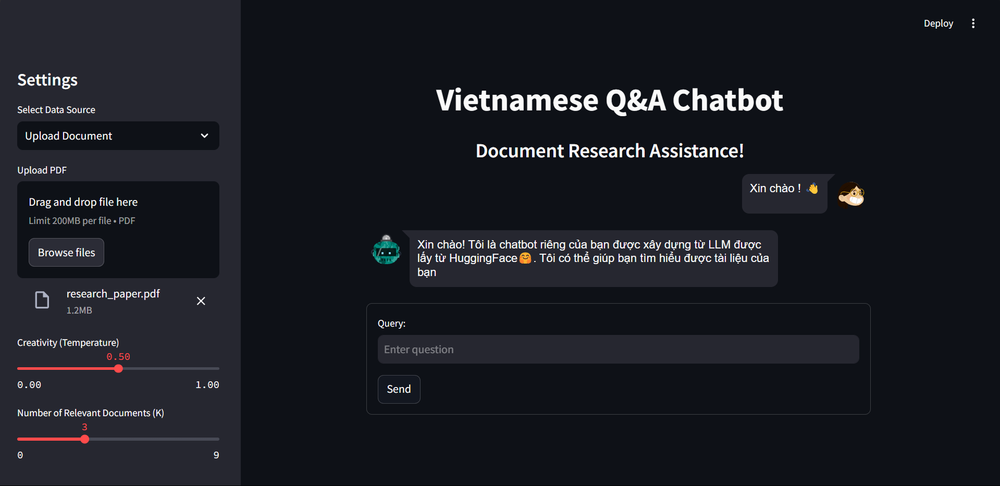

# Vietnamese Q&A Chatbot with RAG
<<<<<<< HEAD

## Overview

This project implements a Vietnamese Question and Answer (Q&A) chatbot using Retrieval-Augmented Generation (RAG). 
The chatbot leverages both a retrieval mechanism to fetch relevant context and a generative model to produce coherent and contextually appropriate responses. This approach allows for more accurate and informative answers to user queries in Vietnamese.

## Features

- **Natural Language Processing**: Understands and processes queries in Vietnamese.
- **Retrieval-Augmented Generation**: Combines retrieval techniques with generative models for enhanced accuracy.
- **Multi-turn Conversations**: Capable of maintaining context across multiple interactions.
- **Customizable Knowledge Base**: Easily update the knowledge base with new information.

## Installation

To set up the project, follow these steps:

1. **Clone the repository**:
   ```bash
   git clone https://github.com/JohnnysGithubAccount/Q-and-A-on-how-to-write-a-research-paper.git

2. **Install dependencies**:
   ```bash
   pip install -r requirements.txt

3. **Download Pre-trained Models**:
    You can go look for the model by using the name on Hugging Face.

## Usage

1. **Run the chatbot**:
    After setting up, you can start chatbot server.
    
    ```bash
   cd "better version"
   streamlit run main.py


2. **Jump to web app**:
    
   
=======
>>>>>>> 90eab4dabe67fd905769f2df558dd2046d985692
